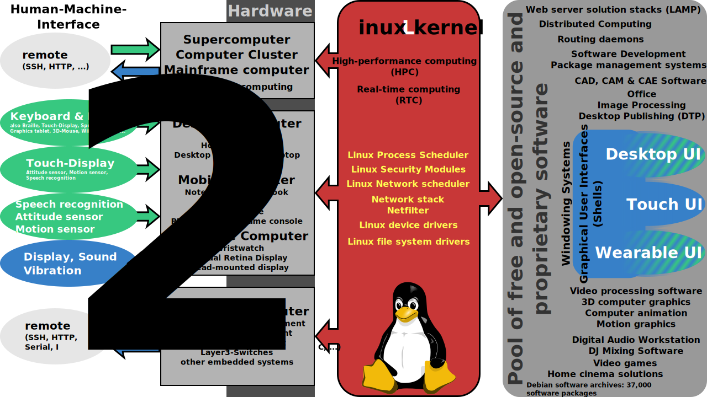

Linux and Terminals
========================================================================
Bijan Chokoufe Nejad <!-- .element: class="fragment" -->
From Zero to Hero <!-- .element: class="fragment" -->
-----

 <!-- .element: class="fragment" -->
 &nbsp; &nbsp; &nbsp; &nbsp; &nbsp; &nbsp; &nbsp;
 <!-- .element: class="fragment" -->

July 17, 2017

Note:
- Welcome everyone
- Say who you are (PhD Student, over 3 years @DESY, worked over 4 years
  exclusively on Linux only)

---
Session overview
------------------------------------------------------------------------
1. <mark>Intro, Linux basics and file management</mark>
2. More commands and piping
3. Bash scripting
4. Regular Expressions
5. Makefiles
6. Git
7. DESY IT (Sven Sternberger)
Note:
- Lectures will be hands on, so we try the stuff we see directly
- Everyone noted at least basic programming skills

---
Linux history
------------------------------------------------------------------------
<div id="left-big">
<mark>Linux</mark> (a.k.a. <mark>GNU/Linux</mark>) was first released by
<mark>Linus Torvalds</mark> in <mark>September 17, 1991</mark>.
</div>

<div id="right-small">

</div>

> I'm doing a (free) operating system (just a hobby, won't be big and
> professional like gnu) for 386(486) AT clones. [...]
> It is NOT protable (uses 386 task switching etc), and it probably
> never will support anything other than AT-harddisks, as that's all I
> have :-(.

Note:
- So Linux was just hacking an operating system on the only machine he
  had access to
- The idea of a free OS caught on massively and countless people
  contributed

===
Linux history
------------------------------------------------------------------------
<br>
<div id="left-big">
  Many more <mark>anecdotes</mark> on how Linux was created can be found in the
  autobiography of Linus
</div>
<div id="right-small">
    
    
</div>

Note:
- If you linke anecdotes, I can highly recommend the book
- Some weird view points but very entertaining and informative

===
### Nowadays, Linux runs (almost) everywhere ###


===
Unix ancestry
------------------------------------------------------------------------
<div id="left-big">
  
</div>
<div id="right-small" style="font-size:smaller">
  <p>
  Many similarities, especially through `POSIX`, `SUS`, `LSB`, `ISO` and
  `ANSI` standards
  </p> <!-- .element: class="fragment" -->
  <br>
  <p>
  Thus, at its core, `macOS` and `Linux` are fairly similar.
  </p> <!-- .element: class="fragment" -->
  <br>
   <!-- .element: class="fragment" -->
</div>

Note:
- Tell story about `sed -i`

---
Linux distributions
------------------------------------------------------------------------
In a distribution, you not only get the <mark>Linux kernel</mark> but
various <mark>software</mark> and usually have a <mark>package
manager</mark> as well as a default <mark>graphical interface</mark>
<br><br>

<p>Well known distributions are `Debian`, `Ubuntu`, `Red Hat`, `Fedora`,
`SUSE`, `Gentoo`, `Arch` and `Scientific Linux`
</p> <!-- .element: class="fragment" -->
<br><br>

<p>At <mark>DESY</mark>, we currently have `Ubuntu 14.04/16.04` (based
on `Debian`) and `Scientific Linux` (based on `Red Hat`)
</p><!-- .element: class="fragment" -->

===
Flavor of the month?
------------------------------------------------------------------------


(according to <mark>distrowatch</mark>, not really representative)

===
Handy guide to decide
------------------------------------------------------------------------


===
So what distro are you currently on?
========================================================================

<br>

```bash
  lsb_release -a
  # No LSB modules are available.
  # Distributor ID: elementary
  # Description:    elementary OS 0.4.1 Loki
  # Release:        0.4.1
  # Codename:       loki
```
<!-- .element: class="fragment" -->

===
Packet Managers
------------------------------------------------------------------------
<p>
  Maybe the most important aspect of a distribution apart from the
  <mark>community</mark> (size, friendlyness, competence)
</p><!-- .element: class="fragment" -->

<p>
  Packet managers are designed to <br>
  make dealing with software <mark>easy</mark>
</p><!-- .element: class="fragment" -->

<p>
  They have means to <mark>install</mark>, <mark>update</mark> and
  <mark>remove</mark>, <br> while respecting <mark>dependencies</mark>.
</p><!-- .element: class="fragment" -->

<p>
  A dependency is not only a certain program or library but also the
  respective <mark>version number</mark> and installations can fail when
  dependencies collide (<mark>dependency hell</mark>)
</p><!-- .element: class="fragment" -->

Note:
- respecting means they automatically install or remove as long as the
    dependency needed

===
Packet Managers
------------------------------------------------------------------------
You might know `apt(-get)` (Ubuntu & Debian) others are `rpm/yum`, `zypper`,
`pacman` or `portage`.

<br>

<div>
Related to the package manager are
- <mark>support cycles</mark> for security fixes (from months to years)
- <mark>stability</mark> (can an update break my system?)
- <mark>up-to-dateness</mark> (how often do I get new major versions?)
</div><!-- .element: class="fragment" -->

---
Interfaces
------------------------------------------------------------------------


Ever since the <mark>Macintosh of 1984</mark>, the <mark>mouse</mark>
and <mark>graphical interfaces</mark> are considered the simplest
interface

<p>
  But is it the <mark>most efficient</mark> for <mark>complex tasks</mark>?
</p><!-- .element: class="fragment" -->

Note:
- How do we interact with computers?
- Nowadays we are used to interact with computers via graphical
  interfaces
- Most often with a mouse

===
Enter the Terminal
------------------------------------------------------------------------
<div id="left">
A terminal is a <mark>device</mark> to
<br>
<ul>
<li> <mark>enter data into</mark></li>
<li> <mark>display data from</mark></li>
</ul>
a computer/computing system
<br><br>

<p>
  Nowadays, we usually have multiple <mark>virtual consoles</mark> or
  <mark>terminal emulators</mark>
</p><!-- .element: class="fragment" -->
</div>
<div id="right">
  
</div>

Note:
- Showcase CTRL-ALT-F1 and multiple terminals

===
So what is a shell?
------------------------------------------------------------------------
<p>
  The <mark>shell</mark> is <mark>a layer around</mark> the
  <mark>operating system kernel</mark>
</p><!-- .element: class="fragment" -->
<br>

<p>
  Both command-line interfaces (<mark>CLI</mark>) as well as <br>
  graphical user interfaces (<mark>GUI</mark>) can be shells
</p><!-- .element: class="fragment" -->
<br>

<p>
  Informally, we usually mean CLI shells when we say shell
</p><!-- .element: class="fragment" -->
<br>

<p>
  We will work with the `bash` shell for simplicity <br>
  (but `zsh` is highly recommended later on)
</p><!-- .element: class="fragment" -->

Note:
- Don't worry, almost everything works the same in bash and zsh. zsh
  just has more extra goodies


===
Command prompt
------------------------------------------------------------------------
The first thing you see, is called <mark>prompt</mark> and <br>
often shows something like
  ```bash
  <username>@<machinename>:<present directory>
  ```
<br>
<div>
  You can customize the prompt by modifying <br>
  the <mark>environment variable</mark> `PS1`
  ```bash
  PS1=YOLO
  ```
</div><!-- .element: class="fragment" -->

---
What else can the shell do?
------------------------------------------------------------------------
<p>
  Time to play around!
</p><!-- .element: class="fragment" -->
<br>
<div>
  ```bash
  echo 'Hello World!'
  # Hello World!
  ```
</div><!-- .element: class="fragment" -->
<div>
  ```bash
  me=Bijan
  echo $me
  # Bijan
  ```
</div><!-- .element: class="fragment" -->
<div>
  ```bash
  echo "Hello $me!"
  # Hello Bijan!
  ```
</div><!-- .element: class="fragment" -->

===
Aliases
------------------------------------------------------------------------
Aliases allow a string to be substituted for a word when it is used as
the <mark>first word</mark> of a command

<div>
  ```bash
  alias
  #
  alias x=exit
  alias
  # alias x='exit'
  unalias x
  alias
  ```
</div><!-- .element: class="fragment" -->
<div>
  So aliases can still take arguments
</div><!-- .element: class="fragment" -->
<div>
  ```bash
  alias e=echo
  e hello
  # hello
  ```
</div><!-- .element: class="fragment" -->

Note:
- Everyone still with me? :)

===
Aliases
------------------------------------------------------------------------
But aliases can not be used as argument
<div>
  ```bash
  alias h=hello
  e h
  # h
  ```
</div><!-- .element: class="fragment" -->
<div>
Aliases are not recursively expanded
</div><!-- .element: class="fragment" -->
<div>
  ```bash
  ls
  # ...
  alias ls='ls --color'
  ls
  # ...
  ```
</div><!-- .element: class="fragment" -->

===
Sourcing
------------------------------------------------------------------------
Read and execute commands from `filename` argument given to `source`
<div>
  ```bash
  source ~/.bashrc
  . ~/.bashrc
  ```
</div><!-- .element: class="fragment" -->
<div>
You can source any file. The Intel compiler can e.g.<br>
be loaded at DESY with
  ```bash
  source /opt/intel/bin/compilervars.sh intel64
  ```
</div><!-- .element: class="fragment" -->
<div>
  The `.bashrc` is somewhat special as it is *usually* loaded by default
  (if not -> modify `.bash_profile` or `.profile`)
</div><!-- .element: class="fragment" -->

===
Some basic directory movements
------------------------------------------------------------------------
We can `c`hange `d`irectory with `cd`
<div>
  ```bash
  cd ~/www
  ls
  ```
</div><!-- .element: class="fragment" -->
<div>
We go up the tree with `..`
  ```bash
  cd ..
  ```
</div><!-- .element: class="fragment" -->
<div>
And back with the dash `-`
  ```bash
  cd -
  ```
</div><!-- .element: class="fragment" -->

===
Some basic directory movements
------------------------------------------------------------------------
`cd` also works without an argument

<div>
Our `p`resent `w`orking `d`irectory is printed by <br>
`pwd` as <mark>absolute pathname</mark>
  ```bash
  pwd
  ```
</div><!-- .element: class="fragment" -->

===
Some important shortcuts
------------------------------------------------------------------------
- Use `<TAB>` for expanding commands, filenames, etc
- Go through command history with `<ARROW-UP>` and `<ARROW-DOWN>`
- `!!` to repeat last command
- `<ALT>+<.>` to repeat last argument of previous command (can be
    repeated)

---
Linux file system
------------------------------------------------------------------------


===
Creating files and directories
------------------------------------------------------------------------
A file is created by `touch`ing it
<div>
  ```bash
  ls myfile
  # ls: cannot access 'myfile': No such file or directory
  touch myfile
  ls myfile
  # myfile
  ```
</div><!-- .element: class="fragment" -->
<div>
A folder is created my `m`a`k`e `dir`
</div><!-- .element: class="fragment" -->
<div>
  ```bash
  ls myfolder
  # ls: cannot access 'myfolder': No such file or directory
  mkdir myfolder
  ls myfolder
  # myfolder
  ```
</div><!-- .element: class="fragment" -->

===
Copy and move
------------------------------------------------------------------------
We always `c`o`p`y from `source` to a `destination` (`r`ecursively if it
is a folder)
<div>
  ```bash
  cp foo.txt bar.txt
  cp foo.txt bar.txt archive
  cp foo.txt bar.txt archive/
  cp -r archive2 archive
  cp archive2/* archive
  ```
</div><!-- .element: class="fragment" -->

<div>
  `m`o`v`ing files and directories is no recursive action
</div><!-- .element: class="fragment" -->
<div>
  ```bash
  mv archive/bar.txt archive2
  mv archive/archive2 archive2
  mv archive2/archive2 .        # !!!
  ```
</div><!-- .element: class="fragment" -->
Note:
- Moving on the same disk is basically instantly (not physically moved,
  just adressbook adjusted)
- Tipp: `alias mv='mv -v'`

===
Removing
------------------------------------------------------------------------
We can `r`e`m`ove files and folders (`r`ecursively if needed)
<div>
  ```bash
  rm foo
  rm -r foofolder
  rm foo1 foo2 foo3
  ```
</div><!-- .element: class="fragment" -->

===
Showing files
------------------------------------------------------------------------
We can `l`i`s`t the directory contents
<div>
  ```bash
  ls
  ls -l
  ls -al
  ls -S
  ls -Sr
  ls -t
  ```
</div><!-- .element: class="fragment" -->
<div>
  Note that `-a` does not ignore entries starting with `.` and that short
  options can be concatenated (`-al` = `-a -l`)
</div><!-- .element: class="fragment" -->
<div>
  Check all options with `man ls` or `ls --help`.
</div><!-- .element: class="fragment" -->

===
Showing content
------------------------------------------------------------------------
`cat` concatenates files and prints them on the terminal
<div>
  ```bash
  cat /usr/share/dict/words   # or
  cat /usr/dict/words
  ```
  Nice start point to edit this stream (cf. later)
</div><!-- .element: class="fragment" -->

<div>
  For reading `less` is more convenient
  ```bash
  less /usr/share/dict/words
  ```
  Navigate with `j/k,gg,G`, help is under `h`, quit with `q`
</div><!-- .element: class="fragment" -->

---
Links
------------------------------------------------------------------------
`l`i`n`ks are like a pointer from one file/directory to another

A <mark>hard</mark> link is an entry in the file system just like a file

Problem with hard links is that they cannot work across file systems

<div>
  <mark>Soft</mark> links are thus preferred for almost everything

  It points to a <mark>relative</mark> or absolute path

  If you delete the source, the link remains as a dead link
</div><!-- .element: class="fragment" -->


===
Setting links
------------------------------------------------------------------------
Like `cp` and `mv`, we `ln` from `SOURCE` to `TARGET`
<div>
  ```bash
  ln -s foo superfoo
  # lrwxrwxrwx 1 bijancn bijancn    3 Jun 10 13:49 superfoo -> foo
  ```
</div><!-- .element: class="fragment" -->
<div>
Can be useful to e.g. keep configuration files<br>
in a synched folder
  ```bash
  ls -la ~/.bashrc
  lrwxrwxrwx 1 bijancn bijancn 35 Jan 31 08:51 /home/bijancn/.bashrc -> /home/bijancn/bcn_scripts/.bashrc
  ```
</div><!-- .element: class="fragment" -->
<div>
Be careful with <mark>relative links</mark>
  ```bash
   ln -s ../foo folder/superfoo
  ```
</div><!-- .element: class="fragment" -->

===
Access rights
------------------------------------------------------------------------
We already saw that `ls -l` informs us not only about
<mark>owner</mark>, <mark>group</mark>, <mark>size</mark>
and <mark>modification date</mark> but also about <mark>rights</mark>
<div id="left-big" style="font-size:smaller">
  ```bash
  ls -l
  # drwxrwxr-x 2 bijancn bijancn 4096 Jun  2 14:13 archive
  # drwxrwxr-x 3 bijancn bijancn 4096 Jun  2 14:13 archive2
  # -rw-rw-r-- 1 bijancn bijancn    0 Jun  2 14:01 bar.txt
  # -rw-rw-r-- 1 bijancn bijancn    0 Jun  2 14:01 foo.txt
  ```
</div>
<div id="right-small">

</div>
- `x` for files means <mark>executable</mark>, for folders
    <mark>enterable</mark>
- `r` for files means <mark>readable</mark>, for folders <mark>listable</mark>
- `w` for files allows to <mark>change</mark>, for folders <mark>to
  change files within</mark>

===
Changing access rights
------------------------------------------------------------------------
We can `ch`ange the `mod`e bits for the `u`ser, `g`roup and `o`thers
<div>
  ```bash
  chmod +x archive
  chmod -x archive
  chmod ug+x archive
  chmod 755 archive
  chmod 644 foo.txt
  ```
</div><!-- .element: class="fragment" -->
<div>
The numbers are derived by adding up bits <br>
(`4`:read, `2`:write, `1`:execute) for `u`ser, `g`roup and `o`thers
</div><!-- .element: class="fragment" -->

<div>
Any file that has the e`x`ecutable bit can be executed
  ```bash
  echo 'ls' >> super-lister
  chmod +x super-lister
  ./super-lister
  ```
</div><!-- .element: class="fragment" -->

===
Folders can be special
------------------------------------------------------------------------
E.g.\ your home folder `~` points at DESY actually to (on SL computers,
on Ubuntu check `~/afs`)?
<div>
  ```bash
  echo ~
  # /afs/desy.de/user/b/bcho
  ```
</div><!-- .element: class="fragment" -->
<div>
The <mark>Andrew File System (AFS)</mark> is a distributed file system
that allows to use the folder on all clients like a physical folder
</div><!-- .element: class="fragment" -->
<div>
Has some issues especially under Ubuntu (`git`, `svn` or `latex` not working
correctly in it). Will eventually be replaced. You can also use
`DESYcloud` to share files. More info in <mark>DESY talk</mark>
</div><!-- .element: class="fragment" -->

===
More special folders
------------------------------------------------------------------------
`/media` is usually used for mounting USB sticks, external hard drives
or CDs/DVDs

`/proc` is not really a folder on disk but <br>
an <mark>interface</mark> to the the kernel

<div>
It contains information about the <mark>hardware</mark> and the running
<mark>processes</mark>

  ```bash
  grep processor /proc/cpuinfo
  cat /proc/partitions
  cat /proc/meminfo
  ```
</div><!-- .element: class="fragment" -->


---
Environment variables
------------------------------------------------------------------------
We played with the `PS1` environment variable. Environment variables
steer many behaviors of the shell

<div>
In general they are set with
  ```bash
  export VARIABLE=value   # an environment variable
  VARIABLE=value          # only a value that lives in the shell
  ```
</div><!-- .element: class="fragment" -->

<div>
They can be accessed by prefixing a `$`
  ```bash
  echo $VARIABLE
  ```
</div><!-- .element: class="fragment" -->


===
Environment variables
------------------------------------------------------------------------
You can overwrite a variable with nothing
<div>
  ```bash
  export VARIABLE=
  ```
</div><!-- .element: class="fragment" -->

<div>
Or `unset` it completely
  ```bash
  unset VARIABLE
  ```
</div><!-- .element: class="fragment" -->
<div>
  Check the difference with `printenv`!

  Do unexported but set variables enter `printenv`s listing?<br>
  (relevant for configuration of some programs, e.g. is `$CC` set?)
</div><!-- .element: class="fragment" -->

===
The PATH to success
------------------------------------------------------------------------
Two particularily important variables are <br>
`$PATH` and `$LD_LIBRARY_PATH`

A shell will try to execute a command if is found <br>
in `$PATH` or the system paths

Multiple paths are combined with `:`

First command found takes priority
<div>
  ```bash
  export PATH=.:$PATH
  file-lister
  echo 'echo "ls is for weaklings"' >> ls
  ls
  ```
</div><!-- .element: class="fragment" -->

===
PATHs for version management
------------------------------------------------------------------------
As `$PATH` is so easily changed, you can have multiple versions of
programs "installed" but only load them as needed

Used in various language version managers (e.g. `nvm` for `nodejs`,
`rvm` for `ruby`, `pyenv` for `python`)

<div>
  If you install a library (will be used for compiling other programs) 
  `$LD_LIBRARY_PATH` has to be set accordingly
  
  When you install a linux program to a `--prefix`, it will set up a `bin`
  folder for executables (add to `$PATH`) and possibly `lib` and `lib64`
  (add to `$LD_LIBRARY_PATH`) or more
</div><!-- .element: class="fragment" -->

===
PATHs for full power
------------------------------------------------------------------------
When you work on a cluster or desktop machine, where IT won't give you
root, don't think you have to beg them for every software you want to
use

<div>
  Setup a default install path (e.g. `~/install`) and <br>
  install all your standard software there <br>
  (via `--prefix=$HOME/install`)
</div><!-- .element: class="fragment" -->

<div>
  Source it with your `.bashrc`, by adding
  ```bash
  export PATH=$HOME/install/bin:$PATH
  export LD_LIBRARY_PATH=$HOME/install/lib:$PATH
  export LD_LIBRARY_PATH=$HOME/install/lib64:$PATH
  ```
</div><!-- .element: class="fragment" -->

===
Exercise PATHing
------------------------------------------------------------------------
- Create two folders `foo` and `foo2`
- Put in each folder an executable file `script` that <br>
  echoes `foo` and `foo2`, respectively
- Go back and adapt your `$PATH` so that <br>
  you can execute `script` and it echoes `foo`
- Change `$PATH` to execute the other `script`

===
Other possibly important variables
------------------------------------------------------------------------
There are some paths concerning your programming language like
`PYTHONPATH` (make python files importable), `C_INCLUDE_PATH` (for
header files)

<div>
  Others drive configuration like `CC` (`C` compiler), <br>
  `CXX` (`C++` compiler), `CFLAGS` (flags for `C` compiler), <br>
  `CXXFLAGS` (flags for `C++` compiler), ...
</div><!-- .element: class="fragment" -->

<div>
  `$TERM` informs your shell about the capabilities of your terminal (like
  `xterm-256color`)
</div><!-- .element: class="fragment" -->

---
Summary
------------------------------------------------------------------------
- Linux provides a powerful shell
- Basic shell commands and file movements
- Basics of Linux file system
- Handling of PATH and other variables
