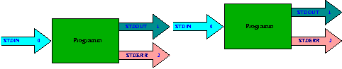

Linux and Terminals
========================================================================
Bijan Chokoufe Nejad <!-- .element: class="fragment" -->
From Zero to Hero <!-- .element: class="fragment" -->
-----

 <!-- .element: class="fragment" -->
 &nbsp; &nbsp; &nbsp; &nbsp; &nbsp; &nbsp; &nbsp;
 <!-- .element: class="fragment" -->

June 13, 2017

---
Session overview
------------------------------------------------------------------------
1. Intro, Linux basics and file management
2. <mark>More commands and piping</mark>
3. Bash scripting
4. Regular Expressions
5. Makefiles
6. Git
7. DESY IT (Sven Sternberger)

---
Streams in Linux
------------------------------------------------------------------------
There are three I/O streams of processes
- standard input (`STDIN`) (0)
- standard output (`STDOUT`) (1)
- standard error (`STDERR`) (2)

The separation of output allows to stream `STDOUT` in another program or
file while still seeing errors on screen

We can redirect `STDERR` to `STDOUT` by <br>
adding `2>&1` when needed

===
Redirecting streams
------------------------------------------------------------------------
<ul>
<li> `program > file` writes output in a `file` instead of printing to
  screen, e.g. `ls -la > listing.log` </li>
<div>
<li> `program >> file` like `>` but attaches to the end instead of
    overwriting `file` </li>
</div><!-- .element: class="fragment" -->
</ul>
<div>
- `program < file` input is taken from `file` instead of keyboard
</div><!-- .element: class="fragment" -->


===
Redirecting examples
------------------------------------------------------------------------
  ```bash
  echo foo > foo.log
  echo foo > foo.log
  cat foo
  echo foo >> foo.log
  echo foo >> foo.log
  cat foo
  ```
<div>
We can also redirect to `/dev/null` (thrown away)
  ```bash
  echo foooo              > /dev/null
  cp archive archive2     2> /dev/null
  cp archive archive2     2>&1 > /dev/null
  cp -vr archive archive2 2>/dev/null 1>&2
  cp -vr archive archive2 1>&2 2>/dev/null
  cp -vr archive archive2 &>/dev/null
  ```
</div><!-- .element: class="fragment" -->


===
Use the pipe
------------------------------------------------------------------------

<br><br>

```bash
  program1 | program2
```

===
Using standard streams
------------------------------------------------------------------------
Many linux commands read from `STDIN` when no filename is given

This allows to easily chain together small "programs"

Comes from the <mark>UNIX philosophy</mark> (Bell System Technical Journal, 1978)

>  Make each program do one thing well.
>  [...]
>  Expect the output of every program to become the input to another, as
>  yet unknown, program

---
More tools
------------------------------------------------------------------------


===
Counting
------------------------------------------------------------------------
We can do a `w`ord `c`ount of files

<div>
  ```bash
  wc /usr/share/dict/words
  # 99171    99171 938848 /usr/share/dict/words
  # newlines words bytes
  ```
</div><!-- .element: class="fragment" -->
<div>
It also sums over multiple files
  ```bash
  wc -l src/*/*nw
  #   ...
  #   1205 src/utilities/utilities.nw
  #   6381 src/variables/variables.nw
  #   3943 src/vegas/vegas.nw
  #  27531 src/whizard-core/whizard.nw
  # 289172 total
  ```
</div><!-- .element: class="fragment" -->

===
Counting Excercise
------------------------------------------------------------------------
- Find out how many folders are in a directory
<div>
  ```bash
  echo */ | wc -w
  ```
</div><!-- .element: class="fragment" -->

<div>
  - Find out how many files and folders are in a directory
</div><!-- .element: class="fragment" -->
<div>
  ```bash
  ls | wc -w
  ```
</div><!-- .element: class="fragment" -->

===
Remove and count duplicates
------------------------------------------------------------------------
`uniq` can filter duplicate lines and count them
<div>
  ```bash
  echo 'foo' >> foo
  echo 'foo' >> foo
  echo 'foo' >> foo
  cat foo
  uniq -c foo
  ```
</div><!-- .element: class="fragment" -->

<div>
  Only counts duplicates next too each other
</div><!-- .element: class="fragment" -->

<div>
`sort`ing the input can help
  ```bash
  echo 'foo' >> foo2
  echo 'bar' >> foo2
  echo 'foo' >> foo2
  cat foo
  cat foo | sort | uniq -c
  ```
</div><!-- .element: class="fragment" -->

===
Disk usage
------------------------------------------------------------------------
`d`isk `u`sage can be shown in `h`uman friendly mode
<div>
  ```bash
  du -h
  ```
</div><!-- .element: class="fragment" -->

<div>
Also `sort` can work with `h`uman friendly sizes
  ```bash
  du -h | sort -h
  ```
</div><!-- .element: class="fragment" -->
<div>
  `du` can also show summaries only
  ```bash
  du -sh -- * | sort -h
  ```
</div><!-- .element: class="fragment" -->

---
Clip and cut
------------------------------------------------------------------------
We can get only the `head` or `tail` of a file or input stream
<div>
  ```bash
  head /usr/share/dict/words
  tail /usr/share/dict/words
  ```
</div><!-- .element: class="fragment" -->
<div>
The number of lines it should be can of course be specified
  ```bash
  head -n1 /usr/share/dict/words
  tail -n15 /usr/share/dict/words
  ```
</div><!-- .element: class="fragment" -->
<div>
`tail` is also great for `f`ollowing logs
  ```bash
  tail -f some-growing-file.log
  ```
</div><!-- .element: class="fragment" -->

===
Downloading
------------------------------------------------------------------------
Most files and even directories can be downloaded<br>
from the net`w`ork with `wget`
<div>
  ```bash
  wget google.de
  wget -r http://www.desy.de/~bcho/top_decay/
  ```
</div><!-- .element: class="fragment" -->
<div>
  Another powerful tool for web interactions is `curl`

  Often similar to `wget` but can also send information

  <div>
  ```bash
  curl https://www.google.de
  curl "https://inspirehep.net/search?p=SEARCHTERM&of=hx&em=B&sf=year&so=d"
  ```
  </div><!-- .element: class="fragment" -->
</div><!-- .element: class="fragment" -->


===
See differences
------------------------------------------------------------------------
`diff` compares files line by line and shows the difference
  ```bash
  # foo            # foo2
  fooo             fooo
  fooo             fooo
  fooo
  ```
  ```bash
  diff foo foo2
  # 3d2
  # < fooo
  ```
In the `3`rd line there is additional content in the left file (`<`)

There is <mark>no output</mark> when there is <mark>no difference</mark>

===
More differences
------------------------------------------------------------------------
Some nice options for `diff`ing
<div>
  ```bash
  diff foo foo2 --side-by-side
  # fooo                      fooo
  # fooo                      fooo
  # fooo                    <
  diff foo foo2 --unified
  # --- foo 2017-06-12 17:02:47.120620683 +0200
  # +++ foo2        2017-06-12 17:02:56.236757886 +0200
  # @@ -1,3 +1,2 @@
  #  fooo
  #  fooo
  # -fooo
  ```
</div><!-- .element: class="fragment" -->

<div>
  `-w` ignores all white space differences
  
  `-B` ignores blank lines
</div><!-- .element: class="fragment" -->

---
Basic searching
------------------------------------------------------------------------
`grep` is a quite powerful search tool that suffices for basic usage
  ```bash
  grep PATTERN file
  ```
<div>
Also works `r`ecursively
  ```bash
  grep -r foo *
  ```
</div><!-- .element: class="fragment" -->
<div>
We could use this to count how often we use certain words
  ```bash
  grep -r obviously * | wc -l
  ```
</div><!-- .element: class="fragment" -->

===
More searching
------------------------------------------------------------------------
Searching helps to get the exact information you need
<div>
  ```bash
  grep 'model name' /proc/cpuinfo | uniq -c
  # 4 model name      : Intel(R) Core(TM) i5-6200U CPU @ 2.30GHz
  ```
</div><!-- .element: class="fragment" -->
<div>
  `grep` can also `c`ount directly
  ```bash
  grep -c 'model name' /proc/cpuinfo
  # 4
  ```
</div><!-- .element: class="fragment" -->

===
More grep options
------------------------------------------------------------------------
<div>
  You can in`v`ert your search with `-v`
  ```bash
  grep -cv 'model name' /proc/cpuinfo
  # 104
  ```
</div><!-- .element: class="fragment" -->

<div>
  Sometimes the case should be ignored
  ```bash
  grep -i intel /proc/cpuinfo
  ```
</div><!-- .element: class="fragment" -->


===
Finding files and directories
------------------------------------------------------------------------


---
Monitoring ourselves
------------------------------------------------------------------------
`ps` gives a `s`napshot of `p`rocesses and with `-eLF` it gives a big
list of processes including the username

We can use this to count our processes
<div>
  ```bash
  ps -eLF | grep ^$USER | wc -l
  ```
</div><!-- .element: class="fragment" -->

<div>
Similarily `top -b -n1` gives a snapshot. We often only care about the
head
</div><!-- .element: class="fragment" -->
<div>
  ```bash
  top -b -n1 | grep $USER | head
  ```
</div><!-- .element: class="fragment" -->


---
Working With Processes
------------------------------------------------------------------------
`<Ctrl>+<C>`: Interrupt (kill) the current foreground process running in
in the terminal. This sends the SIGINT signal to the process, which is
technically just a request—most processes will honor it, but some may
ignore it.

`<Ctrl>+<Z>`: Suspend the current foreground process running in bash.
This sends the SIGTSTP signal to the process. To return the process to
the foreground later, use the fg process_name command.

`<Ctrl>+<D>`: Close the bash shell. This sends an EOF (End-of-file)
marker to bash, and bash exits when it receives this marker. This is
similar to running the exit command.

---
Chaining commands
------------------------------------------------------------------------
There are multiple ways to combine commands

**`command1 ; command2`** <br>
`command2` is executed after `command1` is done <br>
**`command1 && command2`** <br>
`command2` is executed after `command1` is done and returns 0 <br>
**`command1 || command2`** <br>
`command2` is executed after `command1` is done and returns not 0 <br>
**`command1 & command2`** <br>
`command1` is executed in background and `command2` is executed in
foreground at the same time <br>


---
Summary
------------------------------------------------------------------------

