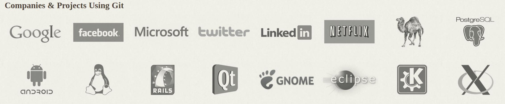

Linux and Terminals
========================================================================
Bijan Chokoufe Nejad <!-- .element: class="fragment" -->
From Zero to Hero <!-- .element: class="fragment" -->
-----

 <!-- .element: class="fragment" -->
 &nbsp; &nbsp; &nbsp; &nbsp; &nbsp; &nbsp; &nbsp;
 <!-- .element: class="fragment" -->

June 14, 2017

Note:
- How close are we to ninja?

---
Session overview
------------------------------------------------------------------------
1. Intro, Linux basics
2. File management in the terminal
3. Combine simple commands
4. One liners (going beyond pipes)
5. Regular Expressions
6. Bash scripting
7. Makefiles
8. <mark>Git</mark>
9. DESY IT (Sven Sternberger)
10. Bonus: Tips and Tricks for Customization
Note:

---
Why do we need version control?
------------------------------------------------------------------------
Two problems
1. <div><mark>Errors</mark>
  - E.g. `rm -r src` instead of `rm -r build`
  - Might want to <mark>go back in time</mark> when some feature of your
    program still worked<br><br>
  </div><!-- .element: class="fragment" -->
2. <div><mark>Collaboration</mark>
  - Ever tried to work on the same document with 5 different people at
    the same time in Dropbox, GoogleDrive, OneDrive, NameYourCloud?
  </div><!-- .element: class="fragment" -->


===
In other words
------------------------------------------------------------------------
<div id="left" style="text-align:center">
In case of

</div><!-- .element: class="fragment" -->

<div id="right" style="text-align:center">
You want to be able to


and more!
</div><!-- .element: class="fragment" -->


===
Version control systems (VCS)
------------------------------------------------------------------------
VCSs keep a <mark>full history of changes</mark>

Two kind of approaches
<div id="left" style="text-align:center">
<mark>Centralized</mark><br>

<ul>
<li> Example: `svn`   </li>
<li> History: <mark>central server</mark> </li>
<li> <mark>Central server</mark> gives out commit numbers (`r1234`)   </li>
<li> <mark>Simple</mark> workflow    </li>
<li> <mark>Impossible</mark> to work offline   </li>
<li> <mark>Hard</mark> to branch and merge   </li>
</ul><!-- .element: class="fragment" -->
</div>
<div id="right">
<mark>Distributed</mark><br>

<ul>
<li> Example: `git`   </li>
<li> History: <mark>everyone</mark> </li>
<li> <mark>Everyone</mark> computes commit hashes (`b50c281`)    </li>
<li> <mark>Bit harder</mark> workflow    </li>
<li> <mark>Trivial</mark> to work offline   </li>
<li> <mark>Easier</mark> to branch and merge   </li>
</ul><!-- .element: class="fragment" -->
</div>

Note:
- What problems can you think of for centralized model? (backups)

===
Speed
------------------------------------------------------------------------


*Smaller is faster*

===
State of the art
------------------------------------------------------------------------
`git` is <mark>undisputed champion</mark>, especially due to <br>
<mark>excellent scaling</mark> to <mark>huge code bases</mark>



Even `windows` has switched their <mark>3500</mark> engineers,
<mark>3.5M</mark> files (`300 GB`) and <mark>250.000</mark> commits over
to <mark>one</mark> `git` repository! (using `GVFS`)

Note:
- not all files are actually cloned but only as needed

---
Using git locally
========================================================================
Almost all features can be used offline/locally (except pushing/pulling)

===
Initialization
------------------------------------------------------------------------
A folder is initialized as git project via `git init`

Creates `.git` subfolder that contains all `git` information

<div>
  ```bash
  mkcd foo
  git init
  la
  git status
  rm -r .git
  git status
  ```
</div><!-- .element: class="fragment" -->

<div>
  You can also copy a `.git` folder from one folder to the other
</div><!-- .element: class="fragment" -->

Note:
- Don't have to modify any files (very unintrusive)

===
Configuration
------------------------------------------------------------------------
`git` wants to (rightly) identify the author of a commit

Check your set name and email with `git config -l`

`git` reads config information from (`/etc/gitconfig`), `~/.gitconfig` and
`.git/config`

<div>
  ```bash
  git config user.name "My Name"
  git config -l
  cat .git/config
  git config --global user.name "My Name"
  git config -l
  cat ~/.gitconfig
  ```
</div><!-- .element: class="fragment" -->

---
Further reading
------------------------------------------------------------------------
https://git-scm.com/
