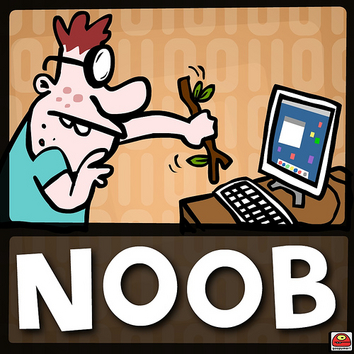
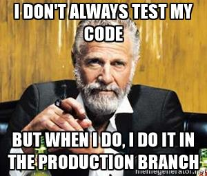

Linux and Terminals
========================================================================
Bijan Chokoufe Nejad <!-- .element: class="fragment" -->
From Zero to Hero <!-- .element: class="fragment" -->
-----

 <!-- .element: class="fragment" -->
 &nbsp; &nbsp; &nbsp; &nbsp; &nbsp; &nbsp; &nbsp;
 <!-- .element: class="fragment" -->

June 14, 2017

Note:
- How close are we to ninja?

---
Session overview
------------------------------------------------------------------------
1. Intro, Linux basics
2. File management in the terminal
3. Combine simple commands
4. One liners (going beyond pipes)
5. Regular Expressions
6. Bash scripting
7. Makefiles
8. <mark>Git</mark>
9. DESY IT (Sven Sternberger)
10. Bonus: Tips and Tricks for Customization
Note:

---
Why do we need version control?
------------------------------------------------------------------------
Two problems
1. <div><mark>Errors</mark>
  - E.g. `rm -r src` instead of `rm -r build`
  - Might want to <mark>go back in time</mark> when some feature of your
    program still worked<br><br>
  </div><!-- .element: class="fragment" -->
2. <div><mark>Collaboration</mark>
  - Ever tried to work on the same document with 5 different people at
    the same time in Dropbox, GoogleDrive, OneDrive, NameYourCloud?
  </div><!-- .element: class="fragment" -->


===
In other words
------------------------------------------------------------------------
<div id="left" style="text-align:center">
In case of

</div><!-- .element: class="fragment" -->

<div id="right" style="text-align:center">
You want to be able to


and more!
</div><!-- .element: class="fragment" -->


===
Version control systems (VCS)
------------------------------------------------------------------------
VCSs keep a <mark>full history of changes</mark>

Two kind of approaches
<div id="left" style="text-align:center">
<mark>Centralized</mark><br>

<ul>
<li> Example: `svn`   </li>
<li> History: <mark>central server</mark> </li>
<li> <mark>Central server</mark> gives out commit numbers (`r1234`)   </li>
<li> <mark>Simple</mark> workflow    </li>
<li> <mark>Impossible</mark> to work offline   </li>
<li> <mark>Hard</mark> to branch and merge   </li>
</ul><!-- .element: class="fragment" -->
</div>
<div id="right">
<mark>Distributed</mark><br>

<ul>
<li> Example: `git`   </li>
<li> History: <mark>everyone</mark> </li>
<li> <mark>Everyone</mark> computes commit hashes (`b50c281`)    </li>
<li> <mark>Bit harder</mark> workflow    </li>
<li> <mark>Trivial</mark> to work offline   </li>
<li> <mark>Easier</mark> to branch and merge   </li>
</ul><!-- .element: class="fragment" -->
</div>

Note:
- What problems can you think of for centralized model? (backups)

===
Speed
------------------------------------------------------------------------


*Smaller is faster*

===
State of the art
------------------------------------------------------------------------
`git` is <mark>undisputed champion</mark>, especially due to <br>
<mark>excellent scaling</mark> to <mark>huge code bases</mark>


Even `windows` has switched their <mark>3500</mark> engineers,
<mark>3.5M</mark> files (`300 GB`) and <mark>250.000</mark> commits over
to <mark>one</mark> `git` repository! (using `GVFS`)

Note:
- not all files are actually cloned but only as needed

---
Using git locally
========================================================================
Almost all features can be used offline/locally <br>
(except pushing/pulling)

===
Initialization
------------------------------------------------------------------------
A folder is initialized as git project via `git init`

Creates `.git` subfolder that contains all `git` information

<div>
  ```bash
  mkcd foo
  git init
  la
  git status
  rm -r .git
  git status
  ```
</div><!-- .element: class="fragment" -->

<div>
  You can also copy a `.git` folder from one folder to the other
</div><!-- .element: class="fragment" -->

Note:
- Don't have to modify any files (very unintrusive)

===
Configuration
------------------------------------------------------------------------
`git` wants to (rightly) identify the author of a commit

Check your set name and email with `git config -l`

`git` reads config information from (`/etc/gitconfig`), `~/.gitconfig` and
`.git/config`

<div>
  ```bash
  git config user.name "My Name"
  git config -l
  cat .git/config
  git config --global user.name "My Name"
  git config --global user.email myname@example.com
  git config -l
  cat ~/.gitconfig
  ```
</div><!-- .element: class="fragment" -->

<div>
  local > global > system
</div><!-- .element: class="fragment" -->

===
Caveat: User friendlyness
------------------------------------------------------------------------
`git` informs you about possible issues. **READ EVERYTHING**

`git status` is your best friend! Shows current status

<div>
  Not all git commands are that intuitive. Some just have to be learned
  (or given a better alias/git alias)
  
  In case of doubt, refer to https://git-scm.com/book/en/v2 or man page
  (can be confusing) or `git help COMMAND` or `git COMMAND --help`
</div><!-- .element: class="fragment" -->

Note:
- So I will not answer questions about why are these commands so weird?
  That is just the way it is.
- They might give different answers

---
Adding files to git
------------------------------------------------------------------------
- `git add FILE` to add a file to <mark>staging</mark>
- `git add .` too add all

<div>
  ```bash
  touch foo
  git add foo
  git status
  ```
</div><!-- .element: class="fragment" -->

===
Git areas
------------------------------------------------------------------------


Note:
- You put stuff on the stage and take stuff back down until you are
  satisfied with your commit

===
Commiting changes
------------------------------------------------------------------------
A <mark>commit</mark> is ideally a closed set of changes that compiles
and leaves the system intact

In reality not always possible but this is the ideal we should strive
for

After we have putten files or changes in staging with `git add`, we
commit with
- `git commit -m "Add files"`
- `git commit`
- `git commit --verbose`

===
Commit message
------------------------------------------------------------------------
- Write in active voice (like a command)
- It should consist of a subject line and a body (like an email)
  ```bash
  Short (50 chars or less) summary of changes

  More detailed explanatory text, if necessary. Wrap it to about 72
  characters. The blank line separating the summary from the body is
  critical (unless you omit the body entirely).

  Further paragraphs come after blank lines.
  - Bullet points are okay, too
  ```
- If you can't write a good commit message, <br>
  it's probably not a good commit
- Try your best every time. Ninjas are trained not born

===
Putting changes to git
------------------------------------------------------------------------
- Recommended way: `git add -p`
  - 1. level of quality control: Use interactive adding to reflect on
    your work and to make sure you only add what you intended to
  - You can double check with `git commit --verbose`


===
Get in the rythm
------------------------------------------------------------------------
- Make changes, add files, delete files
- Add changeset and commit with a good message
- Rinse and repeat
- Try `git rm` vs `rm`. What's the difference?

<div>
  FAQ:
  - How to change last commit message or commit?
    - `git commit --amend`
</div><!-- .element: class="fragment" -->


===
Undoing changes
------------------------------------------------------------------------
<div>
Undoing in staging area (moves the change back to working dir)
  ```bash
  git reset HEAD 
  ```
</div><!-- .element: class="fragment" -->

<div>
Undoing in working directory
  ```bash
  git checkout -- .
  git checkout -- FILE
  ```
</div><!-- .element: class="fragment" -->

---
History
------------------------------------------------------------------------
`git log` shows a history of commits

`git log --graph` shows relationship

`git blame FILENAME` shows commit and author who changed each line.
Great for `blam`ing


===
Reflog
------------------------------------------------------------------------
`git reflog` is your safety net as it contains reference logs to all
commits

Sometimes the only chance to get back a lost commit (you accidentally
deleted a branch, you failed rebasing, ...)

<div>
  ```bash
  git checkout -b test
  touch foo5
  git add foo5
  git commit -m 'test commit'
  git checkout master
  git branch -D test
  git cherry-pick 4c60dd5
  ```
(Cherry pick applies the changes of one or more commits)
</div><!-- .element: class="fragment" -->

===
Seeing the difference
------------------------------------------------------------------------
`git diff` allows to see various differences

Without arguments it shows the difference between working directory and
staging area

`git diff --cached` shows difference between staging and repository

Does not consider untracked files

Can also show differences between branches, commits, etc.<br>
E.g. `git diff master..testing`, `git diff 45f5973..869417b`

===
Sweep your WIP under the rug
------------------------------------------------------------------------
There are various cases where you don't want to commit your changes but
also don't want to throw them away (debug prints e.g.)

`git stash` puts them away (in a list of temporary changes). You can see
them with `git stash list` and inspect with `git stash show`

`git stash apply` applies the most recent stashed changes

---
Branches
------------------------------------------------------------------------
<div id="left-big">

</div>
<div id="right-small">

</div>

Note:
- Many different workflows possible and automatable with tools like
  gitlab
- E.g. only merge to master when all tests work in develop
- Only merge to develop when small test suite works in topic
- Create new topic branches off master

===
Branch creation and deletion
------------------------------------------------------------------------
<div>
  ```bash
  git checkout -b add-foo-file
  touch foo
  git add foo
  git commit -m 'Add foo file'
  git checkout master
  git branch
  #  add-file
  #* master
  cat .git/config
  git checkout -b urgent-hotfix-for-supervisor
  ```
</div><!-- .element: class="fragment" -->
<div>
  Simply delete with `git branch -d my-local-branch` or in `.git/config`
</div><!-- .element: class="fragment" -->

Note:
- Branch is always created from where you currently are
- When you have a remote you would usually do the merging in the UI via
  a merge request commenting your changes


===
Branch merging
------------------------------------------------------------------------

Trivial as long as there is no conflict (we come back to that)

Also simple merge conflicts (one file was changed in two branches but at
different places) can be solved automatically

<div>
  ```bash
  git merge add-foo-file
  ```
</div><!-- .element: class="fragment" -->

===
Branches - Best Practices
------------------------------------------------------------------------
#### (for lonely scientists and small (&le; 20 developers) collaborations)
- Work in <mark>topical branches</mark> (e.g. `fix-bug-in-solver`,
    `update-documentation`, `implement-new-feature`) ideally
    coupled to an <mark>issue tracker</mark> (checkout `DESY JIRA`,
    `bitbucket`, `github`, `gitlab`)
- <div>
  Only put work in topical branches that <mark>belongs there</mark>
</div><!-- .element: class="fragment" -->
- <div>
  Don't be afraid to <mark>branch, merge and close branches</mark> <br>
  (*A branch a day keeps the doctor away*)
</div><!-- .element: class="fragment" -->
- <div>
  Be afraid of <mark>long-term branches</mark> (synchronization costs)
</div><!-- .element: class="fragment" -->
- <div>
  Never work in your `stable`/`master` branch
</div><!-- .element: class="fragment" -->
- **ALWAYS WORK IN TOPICAL BRANCHES, FFS**
<!-- .element: class="fragment" -->

===
So don't be that guy
------------------------------------------------------------------------


Ideally <mark>protect</mark> your <mark>stable branches</mark> and only
allow <br>
<mark>merges from automatically tested branches</mark> <br>
(Continuous Integration: CI)

---


===
Merge conflicts
------------------------------------------------------------------------
Actually not that hard when you get used to it
<div>
  ```bash
  echo "t = 7" >> foo
  echo "d = 14" >> foo
  git add -p
  git commit -m "Add variable setting"
  git checkout -b give-better-names
  git status
  # nano/vim foo and replace a with time and d with distance
  git commit -m "Give t and d better names"
  git checkout master
  # nano/vim foo and replace 7 with 42 and 14 with 43
  git commit -m "Enlarge initilization"
  git merge give-better-names
  # nano/vim foo and resolve merge conflict
  git add foo
  git commit
  ```
</div><!-- .element: class="fragment" -->

===
More conflicts
------------------------------------------------------------------------
Create another merge conflict and try out a three-way merge
(`git config --global merge.conflictsyle diff2`)

It will also show the original above the `|||||||` markers

Usually helps a lot to understand the changes made

---
Adding a remote
------------------------------------------------------------------------
Usually you will have one central <mark>remote</mark> to synchronize with

Can be a simple folder where you can `ssh` into or for the visual
enhancements one of the aforementioned services

You add a remote with the address like this
```bash
git remote add origin git@gitlab.example.com:myname/myprojectname.git
```

Check with `git remote -v `

===
Upstream branches
------------------------------------------------------------------------
The first time we push, we have to make sure the upstream branch is set
correctly

`origin` is git's default name for the remote repo

```bash
  git push -u origin master
  cat .git/config
```
When you want to `push` your branches, make sure they have `remote =
origin` and `merge = refs/heads/BRANCHNAME`

===
Pushing and pulling
------------------------------------------------------------------------
`git push` will try to add your changes to the remote

This will fail when there have been new commits added. Thus, you first
have to get them and merge locally

You get the changes of you collaborators with `git pull`

**NEVER** use `git push --force`. It will destroy the history for
everyone else

FYI: `git pull` is actually a `git fetch` followed by a `git merge` (the
one you already know)


===
One extra layer
------------------------------------------------------------------------


---
Summary
------------------------------------------------------------------------
- `git` is a <mark>very powerful</mark> tool
- I only showed the commands I frequently use
- you <mark>don't have to understand all of it</mark> to <mark>get
  started</mark>
- <mark>avoid copying</mark> complicated plumber commands from SO that
  might damage your history
- just <mark>keep it simple</mark> and <mark>learn as you go</mark>

===
Further reading
------------------------------------------------------------------------
https://git-scm.com/
